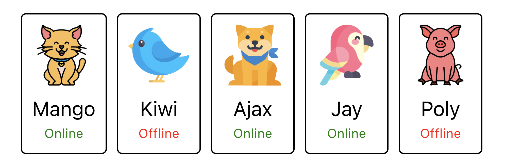

# React-hw-01-Components

## Multi-Platform Deployment (GitHub Pages, Vercel, Netlify, Surge)

**GitHub Pages:** [https://dennisuser1.github.io/react-hw-01/](https://dennisuser1.github.io/react-hw-01/)  
**Vercel:** [react-hw-01-flame.vercel.app](react-hw-01-flame.vercel.app)  
**Netlify:** [https://golden-cannoli-b851a5.netlify.app/](https://golden-cannoli-b851a5.netlify.app/)  
**Surge:** [vite-react-components.surge.sh](vite-react-components.surge.sh)     

## Файли і папки

Структура папок і файлів проєкту в папці `src` має виглядати таким чином:


- Папка `components` - обов'язково з маленької букви + всі букви латинецею.
- Назви папок і файлів компонентів в `PascalCase` нотації. Буде проблема, якщо ви назвете файл або папку з маленької букви, зробите коміт, а потім змінете регістр букви. Git такі зміни не відстежує і такі зміни на GitHub не попадуть, будуть додаткові проблеми.

## Підготовка до роботи

1. Переконайся, що на комп'ютері встановлено LTS-версію Node.js.
   [Скачай та встанови](https://nodejs.org/en/) її якщо необхідно.
2. Встанови базові залежності проекту в терміналі командою `npm install`.
3. Запусти режим розробки, виконавши в терміналі команду `npm run dev`.
4. Перейдіть у браузері за адресою
   [http://localhost:3000/](http://localhost:3000/). Ця сторінка буде автоматично
   перезавантажуватись після збереження змін у файли проекту. 
   Даний Port вказаний в налаштуваннях файла конфігурації `vite.config.js`.
   Можна прибрати в налаштуваннях вказаний Port, тоді адреса за замовчуванням для локального сервера під час розробки [http://localhost:5173](http://localhost:5173).

## Домашнє завдання

+ Створений репозиторій `react-hw-01`.
+ При здачі домашньої роботи є два посилання: на вихідні файли та робочу сторінку завдання на [Vercel](https://vercel.com/).
+ Проєкт створено за допомогою [Vite](https://vitejs.dev/).
+ Під час відвідування живої сторінки завдання, в консолі відсутні помилки і попередження.
+ Для кожного компонента у папці `src/components` є окрема папка, яка містить JSX файл самого React компонента та файл його стилів. Назва папки, файла компонента (з розширенням `.jsx`) та файла стилів (перед `.module.css`) однакова і відповідає назвам, вказаним у завданнях (якщо вони були)
+ Для експорту компонентів використовується експорт за замовчуванням (`export default`).
+ Компоненти всіх завдань рендеряться на одній сторінці, всередині кореневого компонента `<App>`.
+ Все, що компонент очікує у вигляді пропсів, передається йому під час виклику.
+ JS-код чистий та зрозумілий, використовується **Prettier**.
+ Стилізація виконана **CSS-модулями**.
+ Налаштування `eslint.config.cjs`, зокрема, додавання до блоку `rules` властивість `react/prop-types` із значенням `0`.
```
    "react/prop-types": 0
```

**Завдання 1. Профіль соціальної мережі**

Необхідно створити компонент `<Profile>`, за допомогою якого ми могли б відображати інформацію про користувача соціальної мережі.


#### Опис компонента `<Profile>`

Компонент повинен приймати кілька пропсів з інформацією про користувача:

- `name` — ім'я користувача
- `tag` — тег в соціальній мережі без `@`
- `location` — місто і країна
- `image` — посилання на зображення
- `stats` — об'єкт з інформацією про активності

Компонент повинен створювати розмітку наступної структури, але з динамічними даними, що надходять у вигляді описаних раніше пропсів.

```
<div>
  <div>
    
    <p>Petra Marica</p>
    <p>@pmarica</p>
    <p>Salvador, Brasil</p>
  </div>

  <ul>
    <li>
      <span>Followers</span>
      <span>1000</span>
    </li>
    <li>
      <span>Views</span>
      <span>2000</span>
    </li>
    <li>
      <span>Likes</span>
      <span>3000</span>
    </li>
  </ul>
</div>
```
Приведений нижче є **приклад використання компонента** `Profile` у компоненті `App`:

- Рендеримо компонент `Profile` всередині `App`.
- Передаємо компоненту `Profile` дані у вигляді `пропсів`.

Використовуйте ці дані користувача у своїй роботі для значень пропсів.

```
const userData = {
  username: "Jacques Gluke",
  tag: "jgluke",
  location: "Ocho Rios, Jamaica",
  avatar: "https://cdn-icons-png.flaticon.com/512/2922/2922506.png",
  stats: {
    followers: 5603,
    views: 4827,
    likes: 1308
  }
};


const App = () => {
  return (
    <>
      <Profile
        name={userData.username}
        tag={userData.tag}
        location={userData.location}
        image={userData.avatar}
        stats={userData.stats}
      />
    </>
  );
};
```
Треба винести дані користувача в JSON-файл, щоб не завантажувати компонент `App`. Наприклад, створіть у папці `src` файл [userData.json](./src/db/userData.json), перенесіть туди дані користувача, відформатуйте їх у формат JSON, а потім імпортуйте його в `App`, щоб передати ці дані через пропси.

```
import userData from "../userData.json";

const App = () => {
  return (
    <>
      <Profile
        name={userData.username}
        tag={userData.tag}
        location={userData.location}
        image={userData.avatar}
        stats={userData.stats}
      />
    </>
  );
};

```

**Завдання 2. Секція статистики**

Створити компонент `<Statistics>`, який би відображав статистику з переданих пропсів. Наприклад, завантаження у хмару за типом файлів, відвідування веб-сторінки користувачами різних країн, фінансові витрати тощо. Дані про статистику лежать у файлі [data.json](./src/db/statisticsData.json).


**Опис компонента** `<Statistics>`

Компонент повинен приймати два пропи `title` і `stats`, в яких вказується
заголовок та об'єкт статистики.

- `title` – не обов'язковий, і якщо він не переданий, не повинна рендеритись
  розмітка заголовка `<h2>`.
- `stats` – масив об'єктів, що містять інформацію про елемент статистики. Може
  мати довільну кількість елементів.
- Колір фону елемента статистики в оформленні можна пропустити або створити функцію для генерації випадкового кольору.

Компонент повинен створювати DOM елемент наступної структури.

```
<section class="statistics">

  <h2 class="title">Upload stats</h2>

  <ul class="stat-list">
    <li class="item">
      <span class="label">.docx</span>
      <span class="percentage">4%</span>
    </li>
    <li class="item">
      <span class="label">.mp3</span>
      <span class="percentage">14%</span>
    </li>
    <li class="item">
      <span class="label">.pdf</span>
      <span class="percentage">41%</span>
    </li>
    <li class="item">
      <span class="label">.mp4</span>
      <span class="percentage">12%</span>
    </li>
  </ul>
</section>
```
**Приклад використання**

```
import data from '/path/to/data.json';

<Statistics title="Upload stats" stats={data} />
<Statistics stats={data} />
```

**Завдання 3. Список друзів**

Необхідно створити компонент `<FriendList>`, за допомогою якого ми могли б відображати інформацію про друзів користувача.



Компонент `<FriendList>` повинен приймати один проп `friends` - масив об'єктів друзів та створювати DOM розмітку наступної структури.

```
<ul>
	{/* Кількість li залежить від кількості об'єктів в масиві */}
	<li>
		<FriendListItem />
	</li>
</ul>
```

Компонент `<FriendListItem>` - це картка одного друга, яка повинна приймати кілька пропсів:

- `avatar` - посилання на аватар
- `name` - ім'я друга
- `isOnline` - буль, що сигналізує про стан друга: в мережі або ні.

Компонент `<FriendListItem>` повинен створювати DOM розмітку наступної структури.

```
<div>
  
  <p>Friend name</p>
  <p>Friend status</p>
</div>

```

Залежно від пропа `isOnline`, текст в **p.status** повинен змінюватися, а його колір тексту - також. Якщо значення `true`, то текст `Online` і колір тексту зелений, в іншому випадку текст `Offline` і червоний колір тексту. Це можна зробити за допомогою різних CSS-класів.

**Приклад використання компонента** `FriendList` в компоненті `App`. Дані про друзі це масив об'єктів із відомими властивостями. Використовуй ці дані в своїй роботі для значень пропсів.

```
const friends = [
  {
    avatar: "https://cdn-icons-png.flaticon.com/512/1998/1998592.png",
    name: "Mango",
    isOnline: true,
    id: 1812
  },
  {
    avatar: "https://cdn-icons-png.flaticon.com/512/616/616438.png",
    name: "Kiwi",
    isOnline: false,
    id: 1137
  },
  {
    avatar: "https://cdn-icons-png.flaticon.com/512/1623/1623681.png",
    name: "Ajax",
    isOnline: true,
    id: 1213
  },
  {
    avatar: "https://cdn-icons-png.flaticon.com/512/2977/2977285.png",
    name: "Jay",
    isOnline: true,
    id: 1714
  },
  {
    avatar: "https://cdn-icons-png.flaticon.com/512/1998/1998749.png",
    name: "Poly",
    isOnline: false,
    id: 1284
  }
];

const App = () => {
  return (
    <>
      <FriendList friends={friends} />
    </>
  );
};
```

Треба винести дані про друзів в JSON-файл, щоб не ускладнювати компонент `App`. Наприклад, створіть у папці `src` файл [friends.json](./src/db/friends.json), перемістіть туди масив друзів, форматуючи дані під формат JSON, і потім імпортуйте його в `App`, щоб передати ці дані пропсами.

```
import userData from "../userData.json";
import userData from "../statisticsData.json";
import friends from "../friends.json";

const App = () => {
  return (
    <>
      <Profile
        name={userData.username}
        tag={userData.tag}
        location={userData.location}
        image={userData.avatar}
        stats={userData.stats}
      />
      <Statistics stats={data} />
      <FriendList friends={friends} />
    </>
  );
};
```

## Description of how a friend card with animation works

**Description of `FriendList` component:**
The `FriendList` component is responsible for displaying a list of friends, each element of which is a card with information about the friend. After the card is clicked, a rotation animation takes place, which shows dynamic interaction with the user.

**Animation operation:**

1. **Animation activation:** After a friend card is clicked, the `activeId` state is changed using the `useState` hook. The state is then reset and immediately set again for the card to display the animation.

2. **Class for animation:** The card corresponding to the active friend gets `animate` class, which triggers a CSS animation of a `720 degree` rotation. This is created using CSS keyframes `@keyframes spin`.

3. **Animation styles:**

- The animation is only applied to the active card and is executed once on each click.
- Additionally, there is a `hover effect` (hover) that magnifies the card.

**Styles structure:**

- CSS modules are used to isolate styles, which helps to avoid conflicts in class names.
- Depending on the status `(online/offline)`, a colored indicator next to the username is displayed.

**Завдання 4. Історія транзакцій**

Необхідно створити компонент історії транзакцій в особистому кабінеті інтернет-банку.


Дані для списку доступні у форматі массива об'єктів, де кожен об'єкт описує одну транзакцію з наступними властивостями:

- `id` — унікальний ідентифікатор транзакції
- `type` — тип транзакції
- `amount` - сума транзакції
- `currency` - тип валюти

Необхідно створити компонент `<TransactionHistory>`, який приймає один проп `items` - масив об'єктів транзакцій. Компонент створює розмітку таблиці. Кожна транзакція - це рядок таблиці. У прикладі наведена розмітка двох транзакцій.

```
<table>
  <thead>
    <tr>
      <th>Type</th>
      <th>Amount</th>
      <th>Currency</th>
    </tr>
  </thead>

  <tbody>
    <tr>
      <td>Invoice</td>
      <td>125</td>
      <td>USD</td>
    </tr>
    <tr>
      <td>Withdrawal</td>
      <td>85</td>
      <td>USD</td>
    </tr>
  </tbody>
</table>
```

**Приклад використання компонента** `TransactionHistory` у компоненті `App`. Використовуйте ці дані у своїй роботі для значень пропсів.

```
const transactions = [
  {
    id: "1e0700a2-5183-4291-85cc-2065a036a683",
    type: "invoice",
    amount: "964.82",
    currency: "LRD",
  },
  {
    id: "a30f821b-4d25-4ff0-abdd-e340b3f0dd2b",
    type: "payment",
    amount: "686.50",
    currency: "WST",
  },
  {
    id: "44dca67a-8e5a-4798-bf8e-b15efd4e1abd",
    type: "invoice",
    amount: "828.62",
    currency: "UGX",
  },
  {
    id: "ea8ed3dc-2b68-4a53-905a-53ecb0adef33",
    type: "withdrawal",
    amount: "527.80",
    currency: "ALL",
  },
  {
    id: "63ca02f9-d637-46b5-9237-f3b24425e029",
    type: "payment",
    amount: "862.44",
    currency: "AUD",
  },
  {
    id: "ed0263e8-59a5-4bf1-87e0-2bb88e53dc34",
    type: "withdrawal",
    amount: "907.00",
    currency: "GEL",
  },
  {
    id: "4eaab41b-b967-40ac-82ed-85fc66f646f1",
    type: "deposit",
    amount: "103.10",
    currency: "BWP",
  },
  {
    id: "9648a350-8469-42d5-8bf3-18090de5fe67",
    type: "withdrawal",
    amount: "322.32",
    currency: "MRO",
  },
  {
    id: "9c5c25fb-1a95-4b2f-8d1f-4c4426d677cc",
    type: "invoice",
    amount: "14.79",
    currency: "PYG",
  }
];

const App = () => {
  return (
    <>
      <TransactionHistory items={transactions} />
    </>
  );
};
```

Треба винести дані про транзакції у JSON-файл, щоб не захламлювати компонент `App`. Наприклад, створіть файл із назвою [transactions.json](./src/db/transactions.json) у папці `src`, перемістіть туди масив транзакцій, відформатуйте дані у формат JSON, а потім імпортуйте його в компонент `App`, щоб передати ці дані як пропси.

```
import userData from "../userData.json";
import userData from "../statisticsData.json";
import friends from "../friends.json";
import transactions from "../transactions.json";


const App = () => {
  return (
    <>
      <Profile
        name={userData.username}
        tag={userData.tag}
        location={userData.location}
        image={userData.avatar}
        stats={userData.stats}
      />
      <Statistics stats={data} />
      <FriendList friends={friends} />
      <TransactionHistory items={transactions} />
    </>
  );
};

```